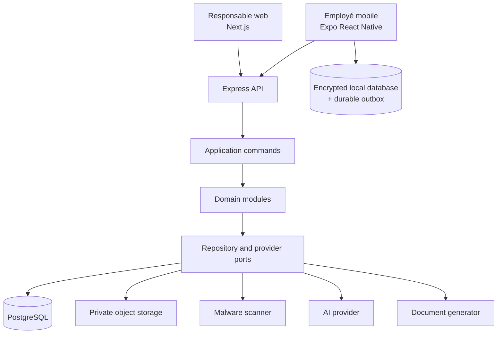
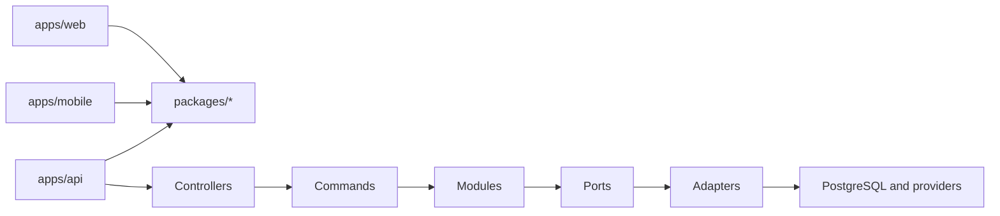
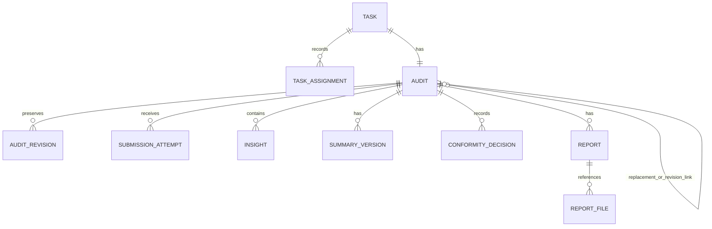
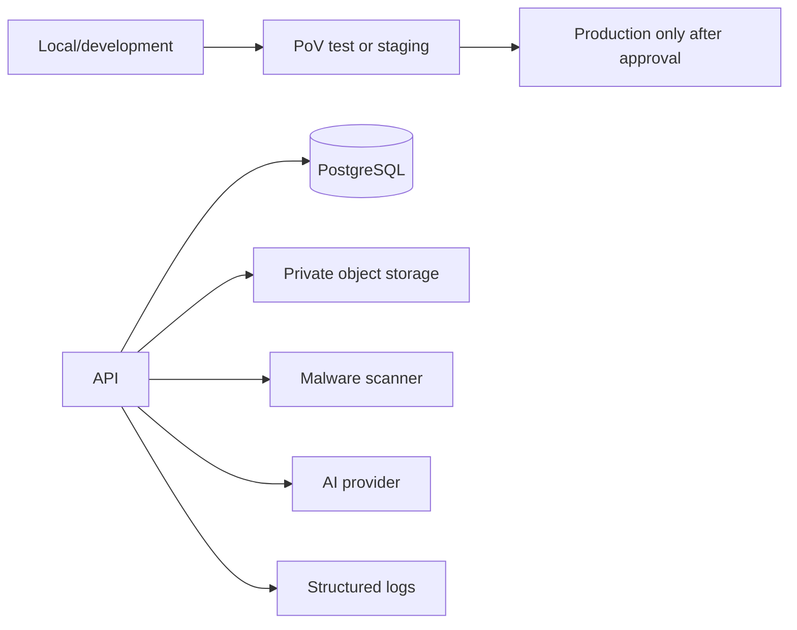

# Architecture Spine — CETEM-BH Graphie Mobile

## Design Paradigm

One deployable Node.js/Express **modular monolith with ports and adapters** is the authoritative system. API controllers invoke module application commands; modules own their state and expose ports; adapters implement persistence and external integrations. PostgreSQL transactions cover authoritative workflow changes.



## Invariants & Rules

### AD-1 — Workspace and client separation [ADOPTED]

- **Binds:** all implementation units
- **Prevents:** web/mobile UI coupling and a heavy build platform for the PoV
- **Rule:** Use one `pnpm` workspace and root lockfile: `apps/web`, `apps/mobile`, `apps/api`, and `packages/types`, `schemas`, `api-client`, `domain`, `config`. No Nx, Turborepo, Bazel, or equivalent unless a measured need is recorded. Web and mobile own their rendered UI; shared packages contain only contracts, schemas, pure logic, and tooling.

### AD-2 — Dependency direction [ADOPTED]

- **Binds:** workspace packages and API modules
- **Prevents:** app-to-app imports, infrastructure leakage, and direct cross-module persistence access
- **Rule:** Apps may depend on shared packages; packages never depend on apps; web and mobile never import each other. `domain` and contracts contain no React, React Native, Next.js, Node, database, or provider code. API controllers depend on application commands; modules use another module's public command/query contract, never its tables or repositories; adapters implement ports.



### AD-3 — Server authority and module ownership [ADOPTED]

- **Binds:** identity-auth, team-access, tasks, audits, sync, calculations, rule-evaluation, insights, summaries, conformity, reports, files, ai, audit-log
- **Prevents:** duplicate lifecycle owners and UI-derived authorization
- **Rule:** `identity-auth` owns authentication, one-time temporary credentials, first-login password change, sessions, and activation checks. The first Responsable is provisioned only through a controlled deployment process: no public registration, bootstrap endpoint, application Administrator role, role selection/elevation, or general Responsable-management UI exists. `team-access` owns roles, team eligibility, and server authorization: a Responsable reaches only own-team resources and an Employé only own assignments; denied requests disclose no protected resource data. `tasks` owns task/assignment metadata; `audits` owns audit aggregates, evidence revisions/snapshots, attribution, history, and lifecycle transitions. `sync` coordinates transfer and reconciliation but never owns audit business state. The server alone authorizes access and establishes accepted workflow state.

### AD-4 — Authoritative audit transitions [ADOPTED]

- **Binds:** FR-019–024, FR-042, OD-01, OD-02, OD-03
- **Prevents:** a local save or transport response being presented as server acceptance, mutable pending submissions, and last-write-wins
- **Rule:** A local draft remains a draft. Explicit submission atomically creates an immutable local snapshot and durable outbox item. Only a successful authoritative server `AcceptSubmission` transaction transitions an audit to `Submitted`; accepted measurements/comments are immutable. Commands include operation ID and base revision; the server persists idempotency outcomes, rejects stale mutations with current metadata, and never merges fields or overwrites stale versions automatically. `CreateReplacementControl` is a Responsable-only transaction over accepted evidence that creates the new task, audit, assignment, and immutable typed `replacement-control` lineage links. `rejected-submission-correction` and `sync-conflict-revision` use distinct typed lineage links and never mean replacement.

### AD-5 — Offline replica and durable outbox [ADOPTED]

- **Binds:** Employé mobile, sync, OD-01, OD-02
- **Prevents:** lost work after process termination, duplicate commands, and ambiguous retry state
- **Rule:** `apps/mobile` uses a transactional encrypted local datastore with separate local audit, snapshot, outbox, sync-engine, transport, conflict-resolution, and secure-key-store boundaries. Save/autosave, pending snapshot plus outbox creation, acceptance/rejection/conflict persistence, correction-draft creation, and successful conflict resolution are local transactions. An outbox item remains until a definitive outcome is persisted locally. Retry is bounded; background work is opportunistic, never required for correctness. Offline authorization lasts at most seven days from successful online authentication and only another successful online authentication resets it; app restarts, saves, transient network loss, and ordinary server-token expiry do not reset or end it. Explicit logout ends it immediately. Expiry or known deactivation preserves data but blocks access/sync until authorization is re-established or administrative recovery applies. For deactivated work: unstarted tasks may be reassigned; synchronized editable drafts preserve attribution and restart work for the new employee; mobile-device-only work is not assumed server-visible; pending/immutable snapshots require explicit resolution and are never reassigned, modified, or deleted automatically.

### AD-6 — Data model and history [ADOPTED]

- **Binds:** PostgreSQL, audits, tasks, summaries, conformity, reports, sync
- **Prevents:** an unstructured workflow document, overwritten evidence, and historical records becoming uninterpretable after rule changes
- **Rule:** PostgreSQL is the sole authoritative server database. Normalize task, assignment, audit, revision/snapshot, submission attempt, insight, summary/version, conformity decision, report/file, sync metadata, and traceability metadata. Store evolving Graphie measurement payloads only as validated versioned JSONB with `schemaVersion` and `ruleSetVersion`; retain formula provenance. Use migrations, foreign keys, transactions, and explicit concurrency tokens. The audit module owns typed immutable lineage records (`replacement-control`, `rejected-submission-correction`, `sync-conflict-revision`); history/report projections derive lineage only from them. Corrections, conflict revisions, replacements, summary versions, past conformity decisions, and report inputs link to predecessors; they do not overwrite history.

### AD-7 — Calculation and rule boundary [ADOPTED]

- **Binds:** FR-025–028, DEP-01, DEP-02
- **Prevents:** inferred tolerance verdicts, automatic overall conformity, and unverifiable historical calculations
- **Rule:** `calculations` runs only CETEM source-derived formulas and records formula/rule provenance. The same versioned pure calculation/rule implementation runs offline on mobile and is revalidated by the server at acceptance; unresolved DEP-01/02 rules remain unavailable rather than fabricated. `rule-evaluation` owns threshold, boundary, special-value, and deterministic-insight evaluation only when CETEM approves them. `insights` owns deterministic proposals, Responsable selection/discard, and manual insight provenance. AI never creates authoritative insights or a conformity decision.

### AD-8 — Summary, decision, and report gates [ADOPTED]

- **Binds:** FR-032–035, FR-038, FR-040–041, OD-10, DEP-03
- **Prevents:** AI becoming a workflow dependency, a report becoming official from obsolete inputs, and in-place alteration of completed evidence
- **Rule:** `summaries` owns AI/manual drafts, versions, confirmation, and reopening. AI requests contain only authorized audit data and retained/manual insights; retain requester/date, exact input-set identity, provider/model provenance, draft output, and final confirmed text without duplicating prompt payloads in logs. `conformity` owns the explicit current/historical human decision. `reports` owns candidates, their generation/upload workflow, freshness, and official designation. Each candidate and async generation/scan attempt is immutably bound to audit revision, summary version, conformity-decision ID, and attempt ID. Reopening a confirmed summary preserves history, invalidates the current conformity decision, and marks dependent candidates outdated. Async completion may set `Ready` only if its bindings remain current and eligible; otherwise retain binary/scan evidence as historical and leave the candidate outdated/non-designatable. Official designation rechecks the same bindings with current summary and decision in its transaction. Manual entry always completes the workflow when AI fails.

### AD-9 — File and provider boundaries [ADOPTED]

- **Binds:** reports, files, ai, notifications
- **Prevents:** provider lock-in, public report exposure, and an unsafe upload being eligible for designation
- **Rule:** `files` owns object operations, metadata, type/structural validation, size enforcement, scan coordination, and authorized download; `reports` owns business meaning. Report files use private object storage and PostgreSQL metadata/references, never database blobs. Manual intake accepts PDF only and enforces a configurable 20 MB limit; reject or quarantine encrypted/protected, corrupt, unreadable, truncated, structurally invalid, or unsafe files. A PDF moves through upload, validation, scan, then `Ready`; incomplete/failed scanning blocks designation and permits retry, never treating an unavailable scan as clean. AI, document generation, object storage, malware scanning, authentication/token handling, and future notification channels are ports with adapters. AI failure never blocks manual summary completion.

### AD-10 — Contracts, validation, and French interface copy [ADOPTED]

- **Binds:** API, web, mobile, packages/types, packages/schemas, packages/api-client
- **Prevents:** incompatible client/server payloads and scattered lifecycle wording
- **Rule:** Maintain one versioned API contract as the source for shared DTOs, Zod schemas where appropriate, and a typed client. Validate untrusted data at server boundaries; clients validate for usability without replacing server authority. Centralize Phase 1 French user-facing strings and approved lifecycle labels; internal code and API identifiers remain English.

### AD-11 — PoV deployment and security envelope [ADOPTED]

- **Binds:** deployment, API, PostgreSQL, providers, observability
- **Prevents:** provider assumptions, committed secrets, public file/database access, and unobservable failed workflows
- **Rule:** Deploy the web app, mobile app, one API, PostgreSQL, private file storage, malware scanning capability, AI integration, and structured logging. Separate local/development and PoV/test/staging; production needs explicit approval. Inject secrets at runtime and never commit credentials, tokens, passwords, or temporary credentials. Use TLS, least-privilege app credentials, private data services where supported, authorized downloads or short-lived access, health/readiness checks, backups with documented restore capability, migrations, rollback/recovery procedures, and correlation IDs. Log failures and traceability events without secrets or unnecessary sensitive payloads. PoV engineering targets are server-backed interaction <=3 s p95, local Save/autosave <=1 s p95, and Word generation <=30 s p95; device/browser matrix, scenarios, conditions, and acceptance owner remain open.

## Consistency Conventions

| Concern | Convention |
| --- | --- |
| Identifiers and dates | Stable opaque IDs; ISO 8601 UTC timestamps; actor/date provenance for state-changing commands. |
| Commands and outcomes | Imperative command names (`SubmitAudit`, `ReopenSummary`, `DesignateOfficialReport`); every retryable authoritative command carries an operation ID and base revision. |
| Error shape | Contracted typed outcome: validation, conflict with current-version metadata, authorization, retryable transport, or internal error. Never translate a transport success into acceptance. |
| State mutation | Application commands are the only server mutation path. Multi-record workflow changes use a PostgreSQL transaction. |
| Validation and rules | Validate payload schema/version before calculations; retain schema, rule, and formula provenance with revision/results. DEP-01/02 restrictions prevent invented verdicts. |
| Security and logs | Server-side authorization on every protected resource; structured logs include correlation ID and event kind, never credentials, tokens, or unnecessary payloads. |
| UI language | French user-facing copy in Phase 1; web/mobile render independently from shared language/tokens. |
| Traceability | Retain actor/date for submission, summary confirmation, conformity decision, and official designation; each report retains task/audit, Responsable, decision, finalization date, origin/metadata, and immutable input bindings. |

## Stack

| Name | Version |
| --- | --- |
| Node.js | 24.21.0 LTS |
| TypeScript | Select and pin after Expo/Next compatibility validation |
| pnpm | 12.7.0 |
| Next.js | 16.3.6 |
| React | 19.2.x |
| Expo | 57.0.25 |
| React Native | 0.86.3 |
| Express | 5.2.1 |
| PostgreSQL | 18.6 |
| Zod | 4.6.5 |

Pin exact compatible dependency patches in workspace manifests and review release/security updates deliberately. TypeScript 6.0.3 is a compatibility baseline observed during architecture review, not a permanent architecture constraint: select and pin the supported stable compiler only after Expo and Next compatibility validation. Expo is the mobile default. At initialization, explicitly choose Expo SDK 57's current continuous-native-generation/prebuild workflow or no generated native projects; validate every native storage, encryption, and secure-key dependency using Expo Doctor and development builds. Move to custom native configuration or bare React Native only when a required dependency fails Expo compatibility, platform support, or security validation. Keep such native infrastructure behind mobile adapters.

## Structural Seed

```text
apps/
  web/                 # Responsable Next.js presentation
  mobile/              # Employé Expo React Native presentation, local DB, sync adapters
  api/                 # Express controllers, commands, modules, ports, adapters
packages/
  types/               # stable shared DTO/domain types
  schemas/             # shared validation schemas
  api-client/          # typed client from API contract
  domain/              # pure lifecycle/calculation/value primitives
  config/              # TS, lint, test, and formatting defaults
```





## Capability → Architecture Map

| Capability / area | Lives in | Governed by |
| --- | --- | --- |
| Account creation, temporary credential, activation/deactivation | identity-auth, team-access | AD-3, AD-11 |
| Team tasks and assignment/reassignment | tasks, audits | AD-3, AD-6 |
| Offline draft, save, submit, reconciliation | mobile local store/outbox, sync, audits | AD-4, AD-5, AD-10 |
| Calculations and post-submission insights | calculations, rule-evaluation, insights | AD-6, AD-7 |
| Summary, human conformity, reopening | summaries, conformity | AD-8 |
| Word/PDF candidates and official report | reports, files | AD-8, AD-9, AD-11 |
| Authorized history/replacement traceability | audits, reports, team-access | AD-3, AD-6, AD-8 |
| French web/mobile experiences | apps/web, apps/mobile, shared language resources | AD-1, AD-10 |

## Phase 1 Scope Boundaries

Graphie fixe execution, Scopie, public registration, a general administration surface, employee-work approval/rejection, real email delivery, automatic PDF generation, general evidence attachments, electronic signatures, signed-scan reintegration, collaborative multi-device editing, and automatic field-level merge are excluded. A notification port may exist for future use but has no Phase 1 delivery adapter or workflow.

## Deferred

| Item | Revisit condition |
| --- | --- |
| Hosting, managed PostgreSQL, storage, scanning, AI, logging, and secret-management vendors | A CETEM/team deployment target and responsible owner are identified. |
| DEP-01 field catalogue, thresholds, special values, deterministic insights, and display precision | CETEM validates the rules; then version schemas/rules and add approved fixtures. |
| DEP-02 calculation/verdict acceptance fixtures | CETEM supplies approved normal, boundary, invalid, and abnormal cases. |
| DEP-03 report template/content/signature/provenance | CETEM approves the document specification. |
| Mobile DB, encryption/key storage, wire format, background execution, and native dependencies | Implementation begins; select only options meeting AD-5 and Expo/device/security validation. |
| OpenAPI generation arrangement and API tooling | Implementation begins; preserve AD-10 regardless of generator choice. |
| Device/OS matrix, acceptance owner, production retention, RPO/RTO, backup cadence, and restore testing | PoV acceptance or a production proposal is planned. |
| Microservices, high availability, multi-region, autoscaling, and enterprise topology | A concrete scale, availability, ownership, or operational requirement justifies them. |
